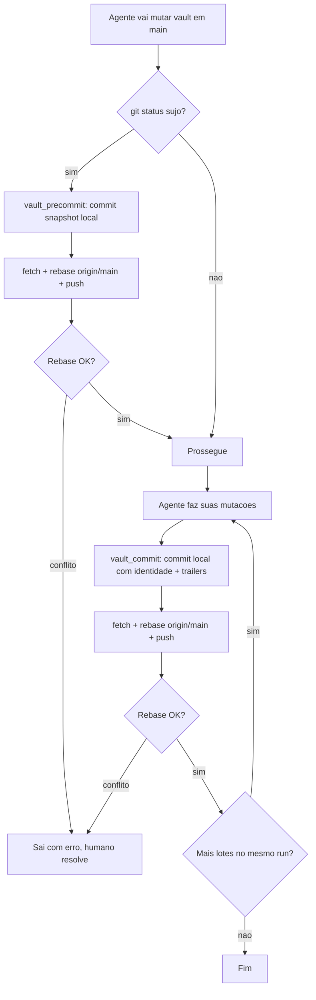
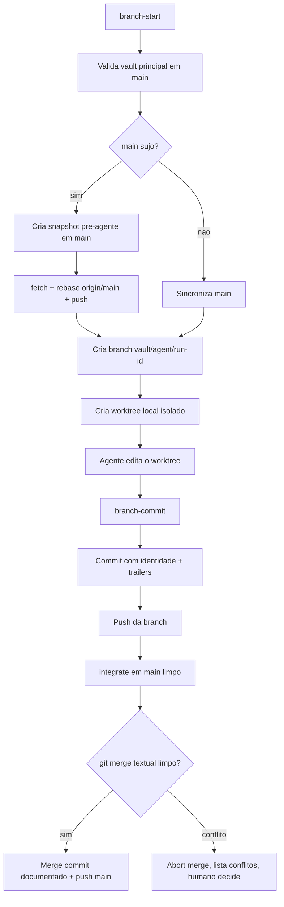

# Política De Version Control Do Vault

Define como agentes (Claude Code, Gemini CLI, Codex, OpenCode, subagents) registram mutações textuais do vault Obsidian em git/GitHub. Objetivo: rastreabilidade total — quem mexeu, em qual nota, qual workflow, quando, por quê.

Escopo: vault de notas médicas (`wiki_dir` via `medical-notes-workbench.paths.v1`). Não se aplica ao workbench (tem política própria).

## Modelo Público

Para usuário leigo, Git é invisível. Experiência pública:

- **ponto de restauração**: estado seguro salvo antes/depois de mutação real;
- **histórico**: lista desses pontos;
- **preview de restauração**: mostra o que seria restaurado sem alterar nada;
- **restaurar**: aplica preview confirmado e cria novo ponto de restauração.

Termos `commit`, `branch`, `merge`, `rebase`, `worktree` são detalhes técnicos. Slash commands e respostas finais só os usam se usuário pedir.

## Princípios

1. **Commit antes, commit depois em workflow mutante.** Working tree sujo antes de uma mutação real → agente primeiro fecha em commit `snapshot:` (isola humano do agente), depois muta e fecha cada lote em commit próprio. `/mednotes:setup` é exceção: se o Git já existe, ele preserva mudanças abertas e não cria snapshot só para limpar o estado.
2. **Um lote = um commit.** 50 notas num run = **um** commit. Não commitar por arquivo.
3. **Identidade por agente.** Trailers no corpo identificam workflow, tool e
   run-id. O author/committer Git usa a identidade nativa do agente/TUI quando
   ela existir. Isso preserva a autoria textual do commit. Para o GitHub
   mostrar avatar, link e filtro por autor, o email dessa identidade precisa
   pertencer a uma conta GitHub real ou bot; se não existir, cai no fallback
   local fixo. GPG opcional — política depende de honestidade do agente.
4. **Commita local, sincroniza, empurra.** Modo sequencial: fecha estado sujo local (`snapshot:` antes, commit identificado depois). Depois `git fetch origin main` + `git rebase origin/main` + `git push origin main`. Evita rebase com working tree sujo. Falha de rede não desfaz commit local; próximo run empurra backlog. Conflito de rebase = humano; agente nunca auto-resolve.
5. **`main` é branch de integração.** Fluxo direto em `main` para runs sequenciais e compatibilidade. Runs paralelos usam `git worktree` separado e branch `vault/<agent>/<run-id>`; integrados em `main` por merge textual limpo. Conflito real = decisão humana, sem resolver conteúdo clínico automaticamente.
6. **Auth herdada do usuário.** Scripts não armazenam token nem pedem senha. Workflows mutantes usam credenciais git globais do ambiente; `/mednotes:setup`, com confirmação humana, pode abrir o fluxo oficial do GitHub CLI para reparar login/credential helper.
7. **Português no commit.** Título e corpo em português do Brasil. Trailers em inglês (chaves estruturadas).

## Gemini CLI Hook Guard

O Gemini CLI Hook Guard é uma camada defensiva empacotada e registrada em
`hooks.json` para enforcement local de FSM/vault. Ele não envia telemetria
remota automática e fica silencioso quando não há cartão FSM ativo, enquanto a
UX pública continua sendo conduzida pelos workflows e pelo `vault_git.py`.

O modo `guard-vault-before` bloqueia escrita direta no vault sem ponto de
restauração ativo, bloqueia Git direto no vault mesmo com lease e permite
`vault_git.py run-start` para abrir a proteção. Os modos FSM capturam somente
JSON oficial com `agent_directive`, injetam contexto curto e bloqueiam P0 quando
a directive ativa proíbe a ação. O agente deve abrir e fechar a proteção uma vez
por lote, não uma vez por nota.

## Identidades

`Agent:` é a identidade operacional canônica do Workbench. O author Git é a
camada visual/de auditoria do GitHub.

Quando o Gemini CLI, OpenCode, Codex ou outro ambiente já expõe uma identidade
Git nativa (por exemplo depois de um setup GitHub da própria TUI), `vault_git.py`
herda essa identidade nos commits do resultado do workflow e salva o mapeamento
por agente em `~/.mednotes/vault.git-identities.json`.
Runs futuros do mesmo agente reutilizam essa identidade mesmo que o processo
seguinte não exponha mais as variáveis Git nativas.

Importante: author Git e autor GitHub clicável não são a mesma camada. Git
aceita qualquer `Nome <email>`. O GitHub só mostra logo/avatar, link de perfil e
filtro por autor quando o email do commit resolve para uma conta GitHub
reconhecida. Para contas modernas com email privado, o formato esperado costuma
ser o no-reply oficial `ID+login@users.noreply.github.com`. Um email inventado
ou genérico como `gemini-cli@users.noreply.github.com` pode preservar a autoria
textual, mas aparecer sem avatar e sem link. O payload do setup/commit expõe
`git_identity_github_attribution` para o agente traduzir essa diferença sem
pedir que o usuário mexa manualmente no Workbench.

Se nenhuma identidade nativa/configurada existir, o fallback continua:

| Agente | Author git fallback | Email fallback |
| --- | --- | --- |
| Claude Code | `claude-code` | `claude-code@medical-notes` |
| Gemini CLI | `gemini-cli` | `gemini-cli@medical-notes` |
| Codex | `codex` | `codex@medical-notes` |
| Subagent genérico | `<nome-do-subagent>` | `<nome>@medical-notes` |
| Snapshot pré-agente | `snapshot` | `snapshot@medical-notes` |
| Edição humana | (config global do usuário) | (config global do usuário) |

Snapshots pré-agente sempre usam `snapshot <snapshot@medical-notes>`, mesmo se
o ambiente do agente tiver identidade GitHub nativa; isso separa mudanças
humanas/prévias das mutações do workflow. Agentes não devem rodar `git commit`
direto na Wiki nem configurar email manualmente durante um workflow: devem
entrar por `run-start`/`run-finish` ou pelos wrappers oficiais, que preservam a
autoria nativa e adicionam trailers estruturados.

Subagents dentro de workflow (ex: `body-linker`, `note-merge`) podem usar identidade própria quando lote todo é atribuível a eles, ou identidade do orquestrador com trailer `Subagent:`. Política conservadora: usar orquestrador, marcar subagent em trailer.

## Formato Do Commit

### Linha 1 (título)

- Imperativo presente, português.
- Até 72 caracteres.
- Estrutura: `<verbo>(<escopo>): <descrição curta>`.
- Verbos canônicos: `cria`, `atualiza`, `remove`, `renomeia`, `move`, `mescla`, `enriquece`, `linka`, `repara`, `publica`, `snapshot`.
- Escopo: nome curto da categoria/pasta/workflow afetado.

Exemplos:

```
enriquece(cardiologia): adiciona imagens em 3 notas de IAM
cria(neuro): nova nota sobre AVC isquêmico
linka(batch): reescreve WikiLinks após merge de duplicatas
repara(grafo): remove 12 links danglings após delete manual
publica(chats): publica 5 notas do batch process-chats 2026-05-14
snapshot: estado antes de /mednotes:enrich rodar
```

### Linha 2 (em branco)

### Corpo

- Antes de escrever o corpo, o agente examina o diff da Wiki: notas `.md`,
  movimentos, deletes, merges, linker e artefatos de workflow.
- O script registra detalhes operacionais fora da Wiki, como `.obsidian/`, em
  bloco separado. O agente não precisa interpretar esse diff para escrever a
  narrativa principal.
- Arquivos `.obsidian/` são importantes para operação do vault; não ignore nem
  descarte.
- Lista das notas tocadas (até ~20 caminhos; acima, agrupar por categoria com contagem).
- Workflow que disparou a mutação.
- Métricas: notas criadas/modificadas/movidas/removidas.
- Validações: dry-run, testes, recibo.
- Erros/warnings ignorados intencionalmente.

### Trailers

Separados do corpo por linha em branco. Chave-valor, uma por linha. Chaves em inglês.

Obrigatórios:

- `Agent:` — mesmo que author (redundância para grep).
- `Workflow:` — slash command ou identificador (`/mednotes:enrich`, `/mednotes:link`, `manual`, `extension-internal`).
- `Run-Id:` — timestamp ISO-8601 UTC do início do run (`2026-05-14T14-30-00Z`).

Opcionais:

- `Tool:` — script/binário que mutou (`enrich_notes.py`, `run-linker`, `publish-batch`).
- `Subagent:` — quando aplicável (`body-linker`, `note-merge`).
- `Trigger-Context:` — caminho relativo do `trigger-context.json` quando commit dispara handoff pro linker.
- `Receipt:` — caminho relativo do recibo JSON quando emitido.
- `Notes-Touched:` — contagem total quando corpo agrupou por categoria.
- `Branch:` — branch `vault/<agent>/<run-id>` quando commit feito em worktree paralelo.

Commits de merge por `integrate` usam trailers próprios para documentar o que entrou em `main`:

- `Integrated-Branch:`
- `Integrated-Agent:`
- `Integrated-Workflow:`
- `Integrated-Run-Id:`

### Exemplo Completo

```
enriquece(cardiologia): adiciona imagens em 3 notas de IAM

Notas modificadas:
- #. Cardiologia/Infarto Agudo do Miocardio.md
- #. Cardiologia/Sindrome Coronariana Aguda.md
- #. Cardiologia/Angina Instavel.md

Workflow /mednotes:enrich rodou em modo apply. 9 imagens inseridas (3 anatomia,
4 esquemas, 2 radiologia). Frontmatter images_* atualizado. Caption em portugues
gerada via Gemini. Ponto de restauracao do vault criado antes da mutacao.

Validacoes: dry-run conferido antes; receipt em .runs/2026-05-14T14-30-00Z/.

Agent: claude-code
Workflow: /mednotes:enrich
Tool: enrich_notes.py
Run-Id: 2026-05-14T14-30-00Z
Receipt: .runs/2026-05-14T14-30-00Z/enrich-receipt.json
Notes-Touched: 3
```

## Snapshot Pré-Agente

Antes de qualquer mutação:

1. O script roda `git status --short --untracked-files=all`, observa diff do
   vault e registra no commit resumo seguro. O agente examina só o diff da Wiki
   para decidir a narrativa; arquivos `.obsidian/` são preservados e
   versionados quando aparecem, mas entram em seção operacional separada, fora
   do foco narrativo.
2. Se houver `modified`/`added`/`deleted`/`untracked` (não no `.gitignore`), faz `git add -A` e commita com author `snapshot`:

```
snapshot: estado antes de <agente> rodar <workflow>

Capturado automaticamente para isolar mutacoes do humano das que o agente fara
a seguir. Conteudo pode ser edicao manual no Obsidian, sincronizacao do plugin,
ou trabalho em andamento.

Alteracoes observadas antes do snapshot:

Mudancas na Wiki observadas antes do snapshot:
-  M Cardiologia/IAM.md
- ?? Pneumo/Nova nota.md

Arquivos operacionais do Obsidian observados:
-  M .obsidian/workspace.json

Diffstat da Wiki rastreada:
-  Cardiologia/IAM.md | 12 +++++++-----

Diffstat operacional do Obsidian:
-  .obsidian/workspace.json | 4 ++--

Agent: snapshot
Workflow: pre-agent-snapshot
Run-Id: <timestamp>
```

3. Faz `git fetch origin main` + `git rebase origin/main` + `git push origin
   main`. Conflito no rebase → aborta e pede resolução humana.
4. Agente prossegue com working tree limpo e snapshot local preservado.

Se `git status` limpo, pula snapshot.

## Modos De Trabalho

Dois modos canônicos.

**Modo sequencial em `main`:** fluxo histórico, simples, compatível com launchers antigos. Usar quando só um agente mexe no vault por vez, ou usuário trabalhando diretamente no checkout do Obsidian.



**Modo paralelo por worktree:** para agentes simultâneos. Cada run ganha checkout próprio fora do vault aberto no Obsidian:

```text
~/.mednotes/vault-worktrees/<run-id>-<agent>
```

Agente edita só o worktree da sua branch. Checkout principal do vault permanece em `main`, limpo e pronto para integrar.



Merge automático = "Git conseguiu mesclar texto sem conflito". Duas branches editando mesma linha, ou contexto ambíguo → `integrate` aborta, lista arquivos conflitados, para. Agente não escolhe versão clínica.

## Scripts Auxiliares

Scripts canônicos em `bundle/scripts/vault/` no repo fonte, copiados para `dist/gemini-cli-bundle/scripts/vault/` no bundle:

- `bundle/scripts/vault/vault_git.py` - núcleo cross-platform, sem deps fora da stdlib, com subcomandos `setup`, `precommit`, `commit`, `run-start`, `run-finish`, `timeline`, `restore-preview`, `restore-apply`, `guard-status`, `branch-start`, `branch-commit` e `integrate`.
- `bundle/scripts/vault/vault_git.sh` - wrapper Bash genérico.
- `bundle/scripts/vault/vault_git.ps1` - wrapper PowerShell genérico.
- `bundle/scripts/vault/vault_precommit.sh` - wrapper Bash para macOS/Linux/Git Bash.
- `bundle/scripts/vault/vault_commit.sh` - wrapper Bash para macOS/Linux/Git Bash.
- `bundle/scripts/vault/vault_precommit.ps1` - wrapper PowerShell para Windows.
- `bundle/scripts/vault/vault_commit.ps1` - wrapper PowerShell para Windows.

Wrappers exigem `uv run --project <raiz> ...` para executar Python. Se `uv` não existir, eles bloqueiam e apontam setup/bootstrap oficial; não há fallback para `python`/`python3`/`py` do sistema. Regra operacional toda em `vault_git.py` — sem duas políticas divergentes entre Bash e PowerShell.

Política **não** depende de `bundle/policies/` nem de mecanismo `policies/` da Gemini CLI. Arquivo distribuído em `bundle/docs/` e no bundle em `docs/`, junto dos demais contratos duráveis.

### Interface Semântica

Workflows públicos devem preferir comandos semânticos:

- `setup`: prepara proteção local, guia login GitHub e propõe repositório
  privado para backup online.
- `run-start`: prepara ponto de restauração antes de mutação real; funciona
  mesmo sem GitHub. A lease técnica aberta para o agente cobre workflows
  longos, e comandos mutantes oficiais renovam essa janela ao entrar pela
  guarda para que um lote legítimo não pareça sem `run-start` no recibo final.
- `run-finish`: fecha run e salva ponto de restauração resultante. Mesmo quando
  não há mudança nova, tenta sincronizar pontos locais pendentes para o backup
  online; se não houver remoto, mantém tudo local e retorna
  `sync_status=skipped_no_remote`. Sem `--run-id`, só fecha automaticamente
  quando existe uma lease ativa única para o mesmo vault, agente e workflow; se
  não houver lease ou houver múltiplas, bloqueia e pede o `--run-id` correto.
  `--run-id ""` é placeholder vazio: bloqueia, não fecha lease e pede o
  `run_id` real emitido por `run-start`. Com `--run-id` explícito, se houver
  lease ativa para o mesmo vault, agente e workflow, o valor precisa ser o
  `run_id` literal emitido por `run-start`; versão normalizada/compactada
  bloqueia como `guard_lease_mismatch` e mantém a lease aberta.
  Relatório público só pode dizer que o guard fechou com
  `guard_lease.status=closed` ou `guard-status` retornando `active_count=0`.
  Em workflows conduzidos por agente, prefira `run-finish --public-json --json`
  para a saída lida pelo modelo: ela preserva `version_control_safety` e remove
  `run_id`, `guard_lease`, lease path e hash de ponto de restauração do stdout.
- `timeline`: lista pontos de restauração para `/mednotes:history`, reporta se
  há pontos locais pendentes de backup online e não altera o vault. Aceita
  `--since` e `--until` e funciona local-only.
- `restore-preview`: mostra arquivos que seriam restaurados, sem alterar vault.
- `restore-apply`: aplica somente preview confirmado e cria novo ponto de restauração. Se houver mudanças abertas e histórico ainda bater com preview, salva automaticamente ponto antes de restaurar.
- `guard-status`: mostra leases ativos da trava técnica sem conteúdo clínico;
  usado por `/mednotes:status`, testes e diagnóstico de suporte.

Comandos técnicos (`precommit`, `commit`, `branch-start`, `branch-commit`, `integrate`) existem para compatibilidade e implementação da política, mas não são interface mental do usuário.
`precommit`/`commit` também podem operar só localmente; `branch-start`,
`branch-commit` e `integrate` exigem backup online/remoto no v1 porque
coordenam runs paralelos. Sem remoto, esses comandos retornam
`blocked_online_backup_required` e apontam para `/mednotes:setup`.

Data do último ponto de restauração e estado do backup online são coisas
diferentes. Um ponto criado há dois dias continua com essa data mesmo se for
enviado ao backup online hoje. Por isso `timeline` expõe `backup_status`:
`synced`, `local_checkpoints_pending`, `remote_changes_pending`, `diverged`,
`unavailable` ou `skipped_no_remote`.

### Guard De Runtime Local

O bundle Gemini CLI registra hooks locais de FSM/vault. Eles não substituem a
proteção determinística: workflows públicos ainda devem chamar
`vault_git.py run-start` e `run-finish`. O guard é por run/lote, não por nota:
abra `run-start` uma vez por lote, altere todas as notas do lote e feche com
`run-finish` uma vez por lote no
final.

Scripts fonte de hook podem permanecer no repositório para histórico e testes
diretos, mas não são a proteção distribuída. Se hooks não estiverem
disponíveis, isso é o estado esperado: os CLIs oficiais que mutam o vault ainda
devem chamar `bundle/scripts/mednotes/vault_guard.py`.

Modo degradado:

- sem `vault.path`, os workflows públicos devem bloquear antes de mutação e
  orientar `/mednotes:setup`;
- se `[paths].raw_dir` estiver configurado, edição direta de raw chats `.md`
  continua proibida; corpo de raw chat é imutável e YAML/status só muda por
  `wiki/cli.py` (`triage`, `discard`, `publish-batch`);
- os CLIs oficiais que mutam o vault devem chamar
  `bundle/scripts/mednotes/vault_guard.py`;
- se uma operação legítima for bloqueada, rode o workflow público correto
  (`/mednotes:fix-wiki`, `/mednotes:link`, `/mednotes:enrich`, etc.).

Bloqueios usam `status=blocked_vault_guard_required`,
`blocked_reason=vault_guard_required`, `recovery_command` e `required_inputs`
para que o agente saiba como retomar sem exigir que o usuário entenda Git.

### Resolução Do Caminho Do Vault

Scripts resolvem caminho do vault nesta ordem:

1. Flag `--vault-dir <path>` (intenção explícita do caller).
2. Variável de ambiente `VAULT_DIR`.
3. Arquivo `~/.mednotes/vault.path` (uma linha com caminho absoluto; espaços e CRLF preservados).
4. Erro fatal — caller precisa configurar uma das opções acima.

Garante que agente rodando de outro diretório (worktree do workbench, shell em outro lugar) encontra vault correto sem depender da CWD.

**Setup recomendado uma vez:**

```bash
echo "/Users/<voce>/Documents/<seu-vault>" \
  > ~/.mednotes/vault.path
```

```powershell
New-Item -ItemType Directory -Force "$HOME\.mednotes"
Set-Content -Encoding utf8 "$HOME\.mednotes\vault.path" `
  "C:\Users\<voce>\Documents\<seu-vault>"
```

### Validação Anti-Engano

Antes de qualquer mutação, scripts validam que caminho resolvido é **realmente o vault**, não outro repo (ex: workbench, que também tem `main` e `.git/`). Checagens:

1. **Caminho é raiz do repo git** — validado com `git rev-parse`, inclusive quando `.git` é arquivo de worktree.
2. **Paths persistidos batem com a raiz Git** — quando `~/.mednotes/config.toml` contém `[paths].wiki_dir`, essa pasta precisa estar dentro da raiz Git validada. Se o caller passar o próprio `wiki_dir` e ele já estiver dentro de um repo Git compatível, o script resolve para a raiz Git antes de gravar `vault.path`.
3. **Branch principal segura** — repo novo nasce em `main`; repo existente em
   outra branch bloqueia com `blocked_branch_confirmation_required` em vez de
   renomear automaticamente.
4. **Remote `origin` quando existir** — proteção local não exige GitHub. Se
   `origin` existir, ele é validado para sincronização; se faltar, comandos
   locais retornam `backup_online=false`.
5. **Allowlist de remote** — se `~/.mednotes/vault.remote-allowlist` existir, URL do `origin` deve constar lá (uma URL por linha; CRLF aceito). Se arquivo não existir, só imprime warning. Se existir e não bater, **bloqueia antes de sincronizar online**.

**Setup recomendado uma vez:** rode `/mednotes:setup` ou o comando oficial
`scripts/vault/vault_git.py setup` depois de persistir `[paths].wiki_dir` e
`[paths].raw_dir` pela API `set-paths`. Esse fluxo grava `vault.path`, valida a
raiz Git contra o `wiki_dir` configurado, mantém allowlist de remoto e ativa
backup online quando disponível. Se o Git já existe, o setup preserva o
histórico e não cria snapshot para "limpar" mudanças humanas ou de plugins; se
o setup criou a proteção local pela primeira vez, ele cria o primeiro ponto a
partir do estado atual. Não crie arquivos de contexto para corrigir paths
durante um workflow; se os caminhos mudaram, chame `set-paths` e repita
`/mednotes:setup`.

Allowlist é defesa final: `--vault-dir` apontando acidentalmente pro workbench
ou para outro repo não compatível com `[paths].wiki_dir` faz o script parar
antes de empurrar para a origem errada.

### Uso Sequencial Em `main`

Antes do agente mutar:

```bash
bundle/scripts/vault/vault_precommit.sh \
  --agent claude-code \
  --workflow /mednotes:enrich
```

```powershell
.\extension\scripts\vault\vault_precommit.ps1 `
  --agent claude-code `
  --workflow /mednotes:enrich
```

Após o agente mutar:

```bash
bundle/scripts/vault/vault_commit.sh \
  --agent claude-code \
  --workflow /mednotes:enrich \
  --tool enrich_notes.py \
  --run-id 2026-05-14T14-30-00Z \
  --title "enriquece(cardiologia): adiciona imagens em 3 notas de IAM" \
  --body-file .runs/2026-05-14T14-30-00Z/commit-body.txt
```

```powershell
.\extension\scripts\vault\vault_commit.ps1 `
  --agent claude-code `
  --workflow /mednotes:enrich `
  --tool enrich_notes.py `
  --run-id 2026-05-14T14-30-00Z `
  --title "enriquece(cardiologia): adiciona imagens em 3 notas de IAM" `
  --body-file .runs\2026-05-14T14-30-00Z\commit-body.txt
```

`--body-file` continua recomendado para o relato escrito pelo agente. Se ele
for omitido, o script gera um `Registro de entrega` legível a partir do diff da
Wiki; arquivos operacionais do Obsidian e trailers técnicos ficam separados no
fim da mensagem.

### Uso Paralelo Por Branch/Worktree

Criar branch/worktree isolada para um run:

```bash
bundle/scripts/vault/vault_git.sh branch-start \
  --agent gemini-cli \
  --workflow /mednotes:fix-wiki \
  --run-id 2026-05-14T14-30-00Z
```

```powershell
.\extension\scripts\vault\vault_git.ps1 branch-start `
  --agent gemini-cli `
  --workflow /mednotes:fix-wiki `
  --run-id 2026-05-14T14-30-00Z
```

Script cria branch sanitizada (sem espaços) no formato:

```text
vault/gemini-cli/2026-05-14T14-30-00Z
```

E worktree local em:

```text
~/.mednotes/vault-worktrees/2026-05-14T14-30-00Z-gemini-cli
```

Após agente editar, commitar e empurrar a branch:

```bash
bundle/scripts/vault/vault_git.sh branch-commit \
  --agent gemini-cli \
  --workflow /mednotes:fix-wiki \
  --run-id 2026-05-14T14-30-00Z \
  --tool run-linker \
  --title "repara(grafo): atualiza links em branch paralela" \
  --body-file .runs/2026-05-14T14-30-00Z/commit-body.txt
```

```powershell
.\extension\scripts\vault\vault_git.ps1 branch-commit `
  --agent gemini-cli `
  --workflow /mednotes:fix-wiki `
  --run-id 2026-05-14T14-30-00Z `
  --tool run-linker `
  --title "repara(grafo): atualiza links em branch paralela" `
  --body-file .runs\2026-05-14T14-30-00Z\commit-body.txt
```

Se `branch-commit` chamado de dentro do próprio worktree, `--run-id` pode ser omitido; script lê branch atual `vault/<agent>/<run-id>`.

Integrar branch em `main`:

```bash
bundle/scripts/vault/vault_git.sh integrate \
  --branch vault/gemini-cli/2026-05-14T14-30-00Z \
  --agent codex \
  --workflow /mednotes:fix-wiki \
  --run-id 2026-05-14T14-30-00Z
```

```powershell
.\extension\scripts\vault\vault_git.ps1 integrate `
  --branch vault/gemini-cli/2026-05-14T14-30-00Z `
  --agent codex `
  --workflow /mednotes:fix-wiki `
  --run-id 2026-05-14T14-30-00Z
```

Merge limpo → `integrate` cria merge commit em `main`, registra `Integrated-Branch`, `Integrated-Agent`, `Integrated-Workflow` e `Integrated-Run-Id`, valida árvore limpa e empurra `main`. Conflito → aborta merge, lista arquivos conflitados, retorna erro.

Os três subcomandos aceitam `--json` para automação. Saída humana em texto simples por padrão.

Dentro da extensão instalada ou de `dist/gemini-cli-bundle/`, wrappers ficam em `scripts/vault/...` (porque `bundle/scripts/` é copiado para `scripts/` do bundle).

## `.gitignore` Do Vault

`.gitignore` do vault é decisão sua, não desta política. Política assume que snapshot pré-agente captura tudo que **não** está no `.gitignore`. Se algo indesejado aparecer nos commits de snapshot, ajuste o `.gitignore` — não desligue a política.

Atenção a artefatos que **são** input de workflow e **devem** ser versionados (mesmo parecendo "cache"):

- Export do plugin Related Notes — input do linker (`/mednotes:link`).
- HTML capturado por `gemini-md-export.artifact-html-manifest.v1` — pode ser referenciado por iframe em notas.
- Recibos/manifests em `.runs/` se quiser auditoria histórica.

## Setup Inicial

O setup público é `/mednotes:setup`, conduzido pelo agente passo a passo. Ele
chama o core semântico, traduz cada estado em linguagem humana e só avança em
login ou criação de repositório depois de confirmação clara:

```bash
uv run python scripts/vault/vault_git.py setup \
  --vault-dir "$VAULT_DIR" \
  --agent gemini-cli \
  --workflow /mednotes:setup \
  --json
```

No Windows PowerShell:

```powershell
uv run python scripts\vault\vault_git.py setup `
  --vault-dir $env:VAULT_DIR `
  --agent gemini-cli `
  --workflow /mednotes:setup `
  --json
```

O comando:

- bloqueia com `blocked_missing_git` se Git não estiver instalado;
- inicializa proteção local se o vault ainda não for repo;
- captura a identidade Git nativa do agente/TUI, quando disponível, para que
  commits futuros da Wiki preservem o author do agente sem setup manual dentro
  do Workbench;
- informa `git_identity_github_attribution`; se o email nativo não for
  reconhecível pelo GitHub, o agente deve explicar que a autoria foi salva, mas
  avatar/link/filtro dependem do setup GitHub nativo usar uma conta GitHub/bot
  real;
- cria `main` em repo novo, mas em repo existente fora de `main` bloqueia com
  `blocked_branch_confirmation_required` antes de renomear qualquer coisa;
- valida `[paths].wiki_dir` e grava `vault.path`; em repo existente preserva
  histórico/mudanças abertas, e em repo novo cria o primeiro ponto a partir do
  estado atual;
- se GitHub ainda não estiver pronto, retorna `local_ready_github_pending` sem
  quebrar a proteção local; workflows mutantes locais já podem criar/restaurar
  pontos neste computador;
- se o GitHub CLI estiver logado e faltar remoto, retorna
  `awaiting_remote_confirmation` com `proposed_private_repo`;
- só cria repositório privado após nova chamada com
  `--confirm-create-remote <owner/repo>` exatamente igual ao proposto;
- quando backup online está pronto, retorna `ready` e grava
  `vault.remote-allowlist`.

`gh auth login` só é iniciado quando o agente está em terminal interativo e o
usuário confirmou esse passo. Em execução não interativa, o setup retorna
`github_login_required` e preserva a proteção local. Operações de rede têm
timeout; push rejeitado por permissão ou branch protection vira
`github_push_failed`, sem deixar estado parcial.

Cobertura automatizada usa `gh` fake e remoto local; login real do GitHub não é
automatizável de forma confiável. Antes de publicar mudanças nesse fluxo, faça
smoke manual em terminal real: rode `/mednotes:setup`, confirme abertura do
login GitHub quando solicitado, confirme criação de repositório privado de
teste e verifique que o estado final fala em proteção local pronta e backup
online conectado.

Termos de Git/GitHub acima são contrato interno; a resposta ao usuário fala em
proteção local, backup online, login GitHub e repositório privado proposto.

## Branch Protection No GitHub

Se vault tiver branch protection em `main` (required reviews, status checks), push direto do agente ou via `integrate` vai falhar. Para esse fluxo, protection deve estar **desligada** em `main` ou ter exceção para o usuário que roda o agente.

Documente no README do repo do vault: "este repo é mutado por agentes via push em main ou integração semi-automática; não habilitar branch protection sem ajustar a política correspondente no workbench."

## Integração Com GitHub Actions / CI

Se vault tiver workflows do GitHub Actions no push (validação YAML, link check, lint markdown), eles **vão** rodar a cada commit do agente. Considerar:

- Workflows devem ser idempotentes e rápidos — agente pode empurrar dezenas de commits por dia.
- Falha no workflow não afeta o push (já aconteceu) — mas você recebe notificação. Use como sinal para ajustar política ou workflow, não para bypassar.
- Não rode CI que faça push de volta no mesmo repo a partir de commit do agente — loop infinito.

## Concorrência

Checkout principal do vault em `main` continua sequencial: só um agente usa `precommit`/`commit` diretamente por vez.

Para paralelismo no mesmo vault, use somente o fluxo `branch-start` -> `branch-commit` -> `integrate`. Regra simples:

- cada agente/run edita seu próprio worktree;
- cada run empurra branch `vault/<agent>/<run-id>`;
- `main` recebe mudanças apenas via `integrate`;
- conflito de merge bloqueia e vira decisão humana.

Não rode dois agentes editando o mesmo checkout principal aberto no Obsidian. Caso contrário, um agente pode capturar mudanças incompletas do outro em snapshot — exatamente o que o fluxo de worktree existe para evitar.

## Voltar No Tempo / Desfazer Mudanças

Para "voltar no tempo", "desfazer", "restaurar antes de X" ou equivalente, interface pública é `/mednotes:history`: listar pontos, mostrar preview, aplicar só após confirmação clara.

Core canônico:

```bash
uv run python scripts/vault/vault_git.py timeline --limit 30 --json
uv run python scripts/vault/vault_git.py restore-preview --to <ponto> --json
uv run python scripts/vault/vault_git.py restore-apply --plan <plan.json> --confirm <plan-id> --agent <agente> --workflow /mednotes:history --json
```

Para alvo temporal claro, use `timeline --since <inicio> --until <fim>` antes de escolher ponto. `restore-apply` nunca roda sem preview confirmado. Se vault tiver mudanças abertas mas histórico ainda for o mesmo do preview, script salva automaticamente ponto "antes da restauração" e segue; se histórico mudou, bloqueia e pede novo preview.

Se `timeline` retornar `backup_status=local_checkpoints_pending`, os pontos já
existem neste computador, mas ainda não foram enviados ao backup online. Um
`run-finish` sem mudanças novas deve sincronizar esse backlog e depois
`timeline` deve ser consultado novamente.

Fallback técnico de manutenção:

Comandos abaixo existem para manutenção manual ou recuperação quando camada semântica (`timeline`, `restore-preview`, `restore-apply`) não estiver disponível. Workflows públicos e agentes atendendo pedido normal do usuário devem usar interface semântica acima, para manter Git invisível.

Regra mental:

- **Mudança já commitada em `main` ou possivelmente compartilhada:** use `git revert --no-commit` seguido de `vault_commit`. Preserva histórico, evita editor interativo, mantém author/trailers corretos.
- **Restaurar arquivo/pasta para conteúdo de commit anterior:** use `git restore --source=<sha> -- <path>` e depois novo commit documentando a restauração.
- **Cancelar mudanças ainda não commitadas que o próprio agente acabou de fazer:** use `git restore --worktree --staged -- <path>` ou equivalente por arquivo. Nunca apague mudanças humanas junto.
- **Mudança só em branch paralela, não integrada:** ajuste ou descarte worktree/branch paralelo; não toque em `main`. Para desfazer só parte do run, use `git restore` dentro do worktree paralelo e rode `branch-commit` novamente.
- **Reescrever histórico com `git reset --hard`, `git push --force` ou similares destrutivos:** só com pedido explícito do usuário, após confirmar alvo e garantir que não há trabalho humano misturado. Não é o caminho padrão.

Comandos de fallback:

```bash
# Ver a linha do tempo recente
git -C "$VAULT_DIR" log --oneline --decorate --max-count=20

# Desfazer um commit já publicado/compartilhado, mantendo commit documentado
git -C "$VAULT_DIR" revert --no-commit <sha>
bundle/scripts/vault/vault_commit.sh \
  --agent <agente> \
  --workflow manual-restore \
  --title "reverte(vault): desfaz <sha>" \
  --body-file <commit-body.txt>

# Restaurar uma nota para o conteúdo de um commit anterior, mantendo histórico
git -C "$VAULT_DIR" restore --source=<sha> -- "Cardiologia/IAM.md"
bundle/scripts/vault/vault_commit.sh \
  --agent <agente> \
  --workflow manual-restore \
  --title "restaura(cardiologia): volta IAM ao estado <sha>" \
  --body-file <commit-body.txt>
```

```powershell
# Ver a linha do tempo recente
git -C $env:VAULT_DIR log --oneline --decorate --max-count=20

# Desfazer um commit já publicado/compartilhado, mantendo commit documentado
git -C $env:VAULT_DIR revert --no-commit <sha>
.\extension\scripts\vault\vault_commit.ps1 `
  --agent <agente> `
  --workflow manual-restore `
  --title "reverte(vault): desfaz <sha>" `
  --body-file <commit-body.txt>

# Restaurar uma nota para o conteúdo de um commit anterior, mantendo histórico
git -C $env:VAULT_DIR restore --source=<sha> -- "Cardiologia/IAM.md"
.\extension\scripts\vault\vault_commit.ps1 `
  --agent <agente> `
  --workflow manual-restore `
  --title "restaura(cardiologia): volta IAM ao estado <sha>" `
  --body-file <commit-body.txt>
```

Commit de restauração deve explicar alvo restaurado, commit de referência e motivo informado pelo usuário. Se `revert --no-commit` gerar conflito, pare e peça resolução humana; não auto-resolva conteúdo clínico.

## Falhas E Recuperação

- **Push falha (rede/auth):** commit local mantido; próximo `vault_commit` empurra backlog. Workflow continua.
- **Fetch falha depois do commit local:** scripts seguem com base local e avisam no stderr. Push subsequente pode ser rejeitado por divergência — cai no próximo caso.
- **Push rejeitado por divergência:** próximo run tenta `fetch` + `rebase
  origin/main` depois de criar commit local necessário. Rebase limpo → segue. Conflito → humano.
- **Conflito de rebase:** scripts saem com erro sem auto-resolver e abortam o rebase. Usuário precisa: abrir arquivo conflitado, escolher versão, finalizar rebase manualmente (`git rebase --continue` ou `git rebase --abort`), re-rodar o agente.
- **Conflito de integração paralela:** `integrate` aborta merge, preserva `main` no commit anterior, lista arquivos conflitados, retorna `blocked_conflict` com `--json`. Ajuste a branch ou faça resolução humana em worktree controlado; rode `integrate` novamente.
- **Auth falha (SSH/PAT inválido):** em `fetch`/`push`, commit local preservado e script avisa no stderr. Usuário conserta config git global e re-roda para empurrar backlog. Scripts usam `GIT_TERMINAL_PROMPT=0` por padrão.
- **Push rejeitado por branch protection:** ajustar config do repo no GitHub conforme seção "Branch Protection No GitHub".
- **Pre-commit hook do vault falha:** investigar antes de bypassar. Nunca usar `--no-verify` por padrão. Consertar a nota é o caminho correto.
- **Commit sem mudanças:** `vault_commit` detecta e é no-op silencioso, não cria commit vazio.

## Auditoria

Para responder "quem mexeu nesta nota e quando":

```bash
git -C $VAULT_DIR log --follow --pretty='format:%h  %ai  %an  %s' -- "<caminho-da-nota>"
```

Para listar tudo que um agente fez num run:

```bash
git -C $VAULT_DIR log --all --pretty='format:%h %s%n%b%n---' --grep "Run-Id: 2026-05-14T14-30-00Z"
```

Para ver só commits de um agente específico:

```bash
git -C $VAULT_DIR log --author='claude-code' --pretty='format:%h %ai %s'
```

## Quando Esta Política Não Se Aplica

- Edição manual humana no Obsidian: usa config git global do usuário, sem trailers obrigatórios. Política cobre apenas commits por agente.
- Operações de manutenção do repo (rebase, tag, branch): humano direto, sem trailers de agente.
